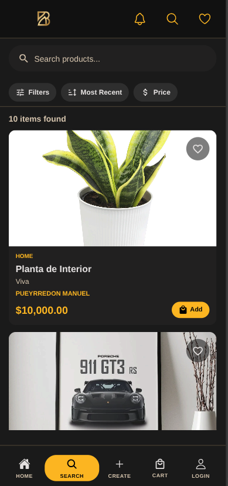
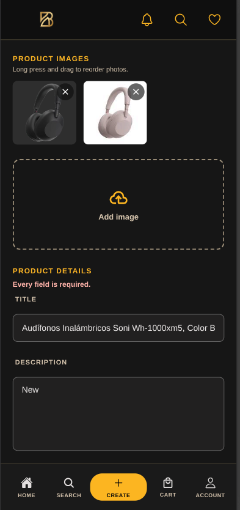
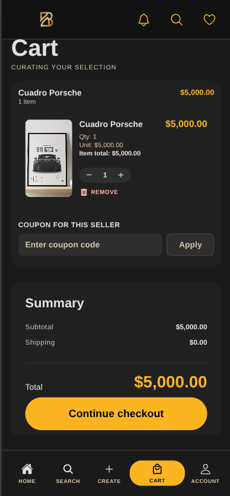

# .github

## Application Preview

<table>
<tr>
<td align="center">
 
<b>Login</b>
</td>

<td width="30"></td>

<td align="center">
 
<b>Home</b>
</td>

<td width="30"></td>

<td align="center">
 
<b>Search</b>
</td>
</tr>

<tr>
<td height="20"></td>
</tr>

<tr>
<td align="center">
 
<b>Create Product</b>
</td>

<td width="30"></td>

<td align="center">
 
<b>Shopping Cart</b>
</td>

<td width="30"></td>

<td align="center">
 
<b>Profile</b>
</td>
</tr>
</table>

## Índice

### 1. Usuarios— Gestión de cuentas: registro, acceso y recuperación.

- [Registro de usuarios]
- [Login con email y contraseña]
- [Recupero de contraseña]
- [Login con proveedor federado]
- [Registro con PIN]
- [Login con datos biométricos]

### 2. Perfil— Identidad del usuario dentro de la plataforma.

- [Edición de perfil]
- [Visualización de perfil propio]
- [Visualización de perfil público]

### 3. Catálogo— Exploración y búsqueda de productos disponibles.

- [Home]
- [Productos populares en home]
- [Listado y búsqueda de productos]
- [Detalle de producto]
- [Compartir link de producto]
- [Filtros avanzados de búsqueda]
- [Ordenamiento de resultados]

### 4. Carrito— Selección y gestión de productos antes de la compra.

- [Agregar producto al carrito]
- [Gestión del carrito]

### 5. Checkout y Órdenes— Flujo de compra, pago y seguimiento del estado de cada orden.

- [Checkout e inicio de pago]
- [Estado y seguimiento de orden]
- [Historial de compras]
- [Cancelar orden]
- [Reembolso simulado al cancelar]
- [Aplicar cupón en checkout]

### 6. Vendedor— Publicación de productos y administración de las propias ventas.

- [Publicar producto]
- [Gestión de stock y publicaciones]
- [Historial de ventas]
- [Crear y gestionar cupones de descuento]

### 7. Reviews— Calificaciones y reputación dentro del ecosistema de compras.

- [Calificar producto y vendedor]
- [Reputación del vendedor en perfil público]

### 8. Administración— Backoffice para la gestión de usuarios y contenido de la plataforma.

- [Listar usuarios del sistema]
- [Bloquear y desbloquear usuario]
- [Listar y moderar productos]
- [Listar órdenes del sistema]

### 9. Métricas— Indicadores de actividad y salud de la plataforma.

- [Métricas del sistema]
- [Métricas por categoría]
- [Exportar datos de métricas]

### 10. Wishlist— Lista de deseos del comprador.

- [Agregar / quitar de wishlist]
- [Visualización de wishlist]

### 11. Notificaciones— Comunicación proactiva al comprador y al vendedor.

- [Notificación de cambio de estado de orden]
- [Notificación de stock bajo al vendedor]

### 12. Recomendaciones— Descubrimiento personalizado de productos.

- [Recomendaciones basadas en historial]

## Architecture

Bazaar was designed as a distributed system following modern software engineering practices.

###  Architectural Principles

- Microservices architecture
- 12-Factor App methodology
- Domain-driven service boundaries
- Event-driven communication
- Fault-tolerant design
- Horizontal scalability
- Containerized deployment

## Microservices

Bazaar is composed of multiple independent services.

| Service | Responsibility | Technology |
|----------|---------------|------------|
| Gateway | API routing and request orchestration | Python |
| Auth Service | Authentication and user identity management | Python + PostgreSQL |
| Product Service | Product catalog and search | Python + MongoDB |
| Cart Service | Shopping cart management | Python + PostgreSQL |
| Order Service | Order lifecycle and order history | Python + PostgreSQL |
| Payment Service | Payment processing | Node.js |
| Bazaar Frontend | Mobile application | React Native + Expo |

